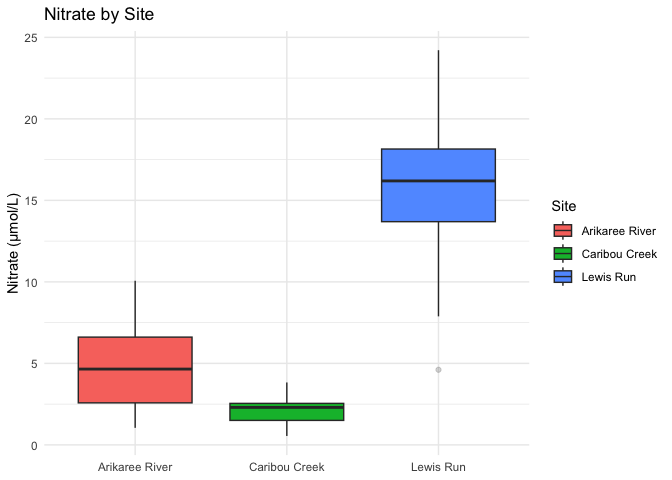

<!-- README.md is generated from README.Rmd. Please edit that file -->

# rainbow

<!-- badges: start -->
<!-- badges: end -->

The goal of rainbow is to …

## Installation

You can install the development version of rainbow from
[GitHub](https://github.com/) with:

``` r
# install.packages("rainbow")
library(ggplot2)
pak::pak("ETC5523-2025/assignment-4-packages-and-shiny-apps-GirikaChopra")
```

## Example

This is a basic example which shows you how to solve a common problem:

``` r
devtools::load_all()
#> ℹ Loading rainbow
df <- rainbow::rivers_data 
```

``` r
#setting seed and creating dataset

set.seed(2626)

sites <- c("Arikaree River","Caribou Creek","Lewis Run")
n_by_site <- c(35, 35, 35)
params <- tibble::tibble(
  Site = sites,
  mean_temp = c(15, 4, 13),
  sd_temp   = c(4, 2, 3),
  mean_do   = c(8, 10, 9),
  sd_do     = c(1.2, 1.0, 1.0),
  mean_cond = c(520, 100, 600),
  sd_cond   = c(60, 30, 70),
  mean_turb = c(6, 12, 15),     
  mean_elev = c(1100, 260, 240),
  sd_elev   = c(20, 20, 15),
  mean_no3  = c(5, 2, 15),
  sd_no3    = c(2, 0.6, 4)
)

rivers_data <- purrr::pmap_dfr(
  list(params$Site, n_by_site, seq_along(sites)),
  function(s, n, i){
    mu <- dplyr::filter(params, Site == s)
    data.frame(
      Site = s,
      Temperature = rnorm(n, mu$mean_temp, mu$sd_temp),
      DissolvedOxygen = rnorm(n, mu$mean_do, mu$sd_do),
      Conductance = rnorm(n, mu$mean_cond, mu$sd_cond),
      Turbidity = rlnorm(n, log(mu$mean_turb), 0.5),
      Elevation = rnorm(n, mu$mean_elev, mu$sd_elev),
      Nitrate = rnorm(n, mu$mean_no3, mu$sd_no3)
    )
  }
)
```

``` r
rivers_data$Site <- factor(rivers_data$Site, levels = sites)

usethis::use_data(rivers_data, overwrite = TRUE) 
#> ✔ Setting active project to
#>   "/Users/girika/Desktop/5523/assignment/A4/assignment-4-packages-and-shiny-apps-GirikaChopra/rainbow".
#> ✔ Saving "rivers_data" to "data/rivers_data.rda".
#> ☐ Document your data (see <https://r-pkgs.org/data.html>).
```

What is special about using `README.Rmd` instead of just `README.md`?
You can include R chunks like so:

You’ll still need to render `README.Rmd` regularly, to keep `README.md`
up-to-date. `devtools::build_readme()` is handy for this.

You can also embed plots, for example:



## Pkgdown Site

<https://etc5523-2025.github.io/assignment-4-packages-and-shiny-apps-GirikaChopra/>

## AI chat

<https://chatgpt.com/share/6909a315-66c8-8011-bd4d-86e3a812f37e>
